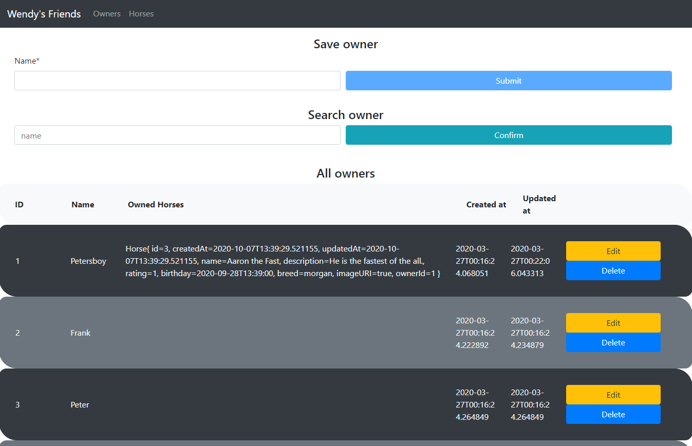

# WendysFriends

A small Web Application developed for a University course. Users are able to store horse data and corresponding jockey data.

## Development server

Run `ng serve --open` to get served a *delicious* meal.

### Jokes aside

As seen on Tuwel, horse breed and -image were made required parameters.
Also, because of security measures, exceptions don't get thrown in smallest detail to the recipient. This was done intentionally, because else parameter-sniffing could become a security loophole.

### Timetable:

| *US / TS* |  *Frontend*  |  *Backend*  | 
|--------:|-----------:|----------:|
|    1    |      5     |     2     |
|    2    |      7     |     3     |
|    3    |      3     |     4     | 
|    4    |      1     |     1     |
|    5    |      2     |     2     |
|    6    |     10     |     6     | 
|    7    |      1     |     1     |
|    8    |      1     |     1     |
|    9    |      1     |     1     | 
|   10    |      4     |     5     |
|   11    |      2     |     7     |
|   12    |      2     |     3     | 
|   13    |      0     |     8     |
|   14    |      1     |     4     |
|   15    |      0     |     0     | 
|   16    |      0     |     3     | 
|   17    |      0     |     2     | 
|   18    |      1     |     3     | 
|   19    |      0     |     1     | 
|   20    |      1     |     4     | 
|   21    |      0     |     2     | 

---

**Sum: 105 hours **
